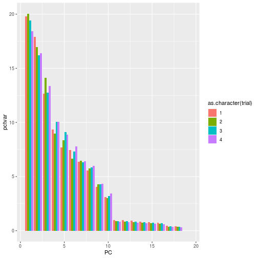
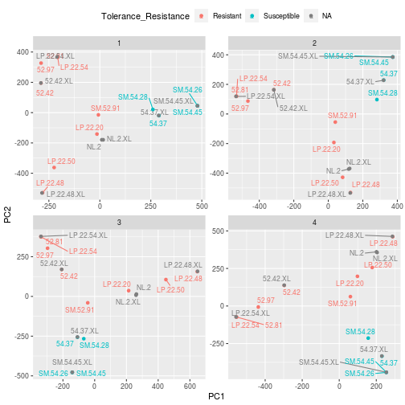
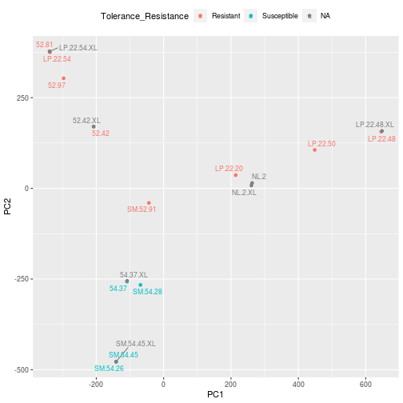

Will make a PCA plot of SNPs, colored by phenotype.

In this version include XL assemblies

__RUNS OUT OF MEMORY ON MY LAPTOP, RUN ELSEWHERE__


```r
library(tidyverse)
```

```
## ── Attaching packages ───────────────────────────────────────────────────────────────────────────────────────────────── tidyverse 1.3.1 ──
```

```
## ✔ ggplot2 3.3.5     ✔ purrr   0.3.4
## ✔ tibble  3.1.2     ✔ dplyr   1.0.7
## ✔ tidyr   1.1.3     ✔ stringr 1.4.0
## ✔ readr   1.4.0     ✔ forcats 0.5.1
```

```
## ── Conflicts ──────────────────────────────────────────────────────────────────────────────────────────────────── tidyverse_conflicts() ──
## ✖ dplyr::filter() masks stats::filter()
## ✖ dplyr::lag()    masks stats::lag()
```

```r
library(VariantAnnotation)
```

```
## Loading required package: BiocGenerics
```

```
## Loading required package: parallel
```

```
## 
## Attaching package: 'BiocGenerics'
```

```
## The following objects are masked from 'package:parallel':
## 
##     clusterApply, clusterApplyLB, clusterCall, clusterEvalQ,
##     clusterExport, clusterMap, parApply, parCapply, parLapply,
##     parLapplyLB, parRapply, parSapply, parSapplyLB
```

```
## The following objects are masked from 'package:dplyr':
## 
##     combine, intersect, setdiff, union
```

```
## The following objects are masked from 'package:stats':
## 
##     IQR, mad, sd, var, xtabs
```

```
## The following objects are masked from 'package:base':
## 
##     anyDuplicated, append, as.data.frame, basename, cbind, colnames,
##     dirname, do.call, duplicated, eval, evalq, Filter, Find, get, grep,
##     grepl, intersect, is.unsorted, lapply, Map, mapply, match, mget,
##     order, paste, pmax, pmax.int, pmin, pmin.int, Position, rank,
##     rbind, Reduce, rownames, sapply, setdiff, sort, table, tapply,
##     union, unique, unsplit, which.max, which.min
```

```
## Loading required package: MatrixGenerics
```

```
## Loading required package: matrixStats
```

```
## 
## Attaching package: 'matrixStats'
```

```
## The following object is masked from 'package:dplyr':
## 
##     count
```

```
## 
## Attaching package: 'MatrixGenerics'
```

```
## The following objects are masked from 'package:matrixStats':
## 
##     colAlls, colAnyNAs, colAnys, colAvgsPerRowSet, colCollapse,
##     colCounts, colCummaxs, colCummins, colCumprods, colCumsums,
##     colDiffs, colIQRDiffs, colIQRs, colLogSumExps, colMadDiffs,
##     colMads, colMaxs, colMeans2, colMedians, colMins, colOrderStats,
##     colProds, colQuantiles, colRanges, colRanks, colSdDiffs, colSds,
##     colSums2, colTabulates, colVarDiffs, colVars, colWeightedMads,
##     colWeightedMeans, colWeightedMedians, colWeightedSds,
##     colWeightedVars, rowAlls, rowAnyNAs, rowAnys, rowAvgsPerColSet,
##     rowCollapse, rowCounts, rowCummaxs, rowCummins, rowCumprods,
##     rowCumsums, rowDiffs, rowIQRDiffs, rowIQRs, rowLogSumExps,
##     rowMadDiffs, rowMads, rowMaxs, rowMeans2, rowMedians, rowMins,
##     rowOrderStats, rowProds, rowQuantiles, rowRanges, rowRanks,
##     rowSdDiffs, rowSds, rowSums2, rowTabulates, rowVarDiffs, rowVars,
##     rowWeightedMads, rowWeightedMeans, rowWeightedMedians,
##     rowWeightedSds, rowWeightedVars
```

```
## Loading required package: GenomeInfoDb
```

```
## Loading required package: S4Vectors
```

```
## Loading required package: stats4
```

```
## 
## Attaching package: 'S4Vectors'
```

```
## The following objects are masked from 'package:dplyr':
## 
##     first, rename
```

```
## The following object is masked from 'package:tidyr':
## 
##     expand
```

```
## The following objects are masked from 'package:base':
## 
##     expand.grid, I, unname
```

```
## Loading required package: IRanges
```

```
## 
## Attaching package: 'IRanges'
```

```
## The following objects are masked from 'package:dplyr':
## 
##     collapse, desc, slice
```

```
## The following object is masked from 'package:purrr':
## 
##     reduce
```

```
## Loading required package: GenomicRanges
```

```
## Loading required package: SummarizedExperiment
```

```
## Loading required package: Biobase
```

```
## Welcome to Bioconductor
## 
##     Vignettes contain introductory material; view with
##     'browseVignettes()'. To cite Bioconductor, see
##     'citation("Biobase")', and for packages 'citation("pkgname")'.
```

```
## 
## Attaching package: 'Biobase'
```

```
## The following object is masked from 'package:MatrixGenerics':
## 
##     rowMedians
```

```
## The following objects are masked from 'package:matrixStats':
## 
##     anyMissing, rowMedians
```

```
## Loading required package: Rsamtools
```

```
## Loading required package: Biostrings
```

```
## Loading required package: XVector
```

```
## 
## Attaching package: 'XVector'
```

```
## The following object is masked from 'package:purrr':
## 
##     compact
```

```
## 
## Attaching package: 'Biostrings'
```

```
## The following object is masked from 'package:base':
## 
##     strsplit
```

```
## 
## Attaching package: 'VariantAnnotation'
```

```
## The following object is masked from 'package:stringr':
## 
##     fixed
```

```
## The following object is masked from 'package:base':
## 
##     tabulate
```

```r
library(ggrepel)
library(snpStats)
```

```
## Loading required package: survival
```

```
## Loading required package: Matrix
```

```
## 
## Attaching package: 'Matrix'
```

```
## The following object is masked from 'package:VariantAnnotation':
## 
##     expand
```

```
## The following object is masked from 'package:S4Vectors':
## 
##     expand
```

```
## The following objects are masked from 'package:tidyr':
## 
##     expand, pack, unpack
```

```r
#datadir <- "/Volumes/GoogleDrive/Shared drives/TanOak/new_12_2021_assembly/"
datadir <- "../input/new_12_2021_assembly/" # for cluster
outdir <- "../output/"
```


```r
tab <- TabixFile(file.path(datadir, "cohort.all.genotyped.vcf.gz"))

tab_seqnames <- seqnamesTabix(tab)

contig.lengths <- read_tsv(file.path(datadir, "PanGenome_ONT_pilon.purge.dedup90.drop2k.mergeN.fasta.fai"), 
                  col_names = c("name", "length", "offset", "lineLength", "lineLengthB")) %>%
  dplyr::select(name, length) %>%
  arrange(desc(length))
```

```
## 
## ── Column specification ──────────────────────────────────────────────────────────────────────────────────────────────────────────────────
## cols(
##   name = col_character(),
##   length = col_double(),
##   offset = col_double(),
##   lineLength = col_double(),
##   lineLengthB = col_double()
## )
```

```r
head(contig.lengths, 10)
```

```
## # A tibble: 10 x 2
##    name        length
##    <chr>        <dbl>
##  1 445_pilon 16254951
##  2 345_pilon 15331457
##  3 268_pilon 12566597
##  4 264_pilon 12485716
##  5 266_pilon 11869767
##  6 265_pilon 10935069
##  7 606_pilon 10588550
##  8 316_pilon 10358023
##  9 353_pilon 10280650
## 10 262_pilon  9808046
```

```r
contig.lengths_tab <- contig.lengths %>%
  filter(name %in% tab_seqnames)
```


```r
## get pheno data
pheno <- read_csv("../input/TanOakResistance.csv") %>%
  mutate(sampleID=str_replace_all(Tanoak, "-","."),
         sampleID=str_replace(sampleID, "SM\\.(52|54)\\.(42|81|97|37)", "\\1.\\2")) %>%
  arrange(Rank_Sorting)
```

```
## 
## ── Column specification ──────────────────────────────────────────────────────────────────────────────────────────────────────────────────
## cols(
##   Tanoak = col_character(),
##   Tolerance_Resistance = col_character(),
##   Rank_Sorting = col_double()
## )
```

function to generate PCs

```r
getPCs <- function(trial) {
  
  print(trial)

  contigs.subset <- which(contig.lengths_tab$group==trial)
  
  #load the contigs
  vcf <-  readVcf(tab, 
                  param=GRanges(
                    seqnames = contig.lengths_tab$name[contigs.subset],
                    ranges = IRanges(
                      start = 1,
                      end=contig.lengths_tab$length[contigs.subset])))
  
  # filter it
  vcf <- vcf[rowRanges(vcf)$QUAL > 50 &
               sapply(info(vcf)$AC, length) == 1 & #stick with biallelic SNPs for now
               info(vcf)$AN == 38] # require complete genotype info for now 
  
  mat <- genotypeToSnpMatrix(vcf)
  mat3 <- as(mat$genotypes, "numeric")
  
  mat3 <- mat3[,apply(mat3, 2, function(x) !any(is.na(x)))]
  
  
  geno.pca <- prcomp(mat3, rank.=10)
  
  return(geno.pca)
}
```

function to calculate pct var

```r
getPctvar <- function(geno.pca) {
  pcvar <- geno.pca$sdev^2 # square std dev to get variance
  pcvar.pct <- tibble(pctvar=pcvar/sum(pcvar) * 100,
                      PC=1:length(pcvar))
}
```

function to make PCA frame for plotting

```r
getPCtibble <- function(geno.pca) {
PCs <- geno.pca$x %>%
  as.data.frame() %>%
  rownames_to_column("sampleID") %>%
  left_join(pheno)
PCs
}
```

figure out subsets

```r
contig.lengths_tab <- contig.lengths_tab %>% arrange(desc(length)) %>%
  mutate(cum_length=cumsum(length)) %>%
  mutate(group=floor((1 + cum_length/100000000)))

contig.lengths_tab
```

```
## # A tibble: 11,330 x 4
##    name        length cum_length group
##    <chr>        <dbl>      <dbl> <dbl>
##  1 445_pilon 16254951   16254951     1
##  2 345_pilon 15331457   31586408     1
##  3 268_pilon 12566597   44153005     1
##  4 264_pilon 12485716   56638721     1
##  5 266_pilon 11869767   68508488     1
##  6 265_pilon 10935069   79443557     1
##  7 606_pilon 10588550   90032107     1
##  8 316_pilon 10358023  100390130     2
##  9 353_pilon 10280650  110670780     2
## 10 262_pilon  9808046  120478826     2
## # … with 11,320 more rows
```


```r
results <- tibble(trial=1:4)
```


run it

```r
results <- results %>%
  mutate(PCs = map(trial, getPCs)) %>%
  mutate(pctvar = map(PCs, getPctvar)) %>%
  mutate(PCtibble = map(PCs, getPCtibble))
```

```
## [1] 1
```

```
## Warning in .bcfHeaderAsSimpleList(header): duplicate keys in header will be
## forced to unique rownames
```

```
## Warning in FUN(X[[i]], ...): duplicate ID's in header will be forced to unique
## rownames
```

```
## Warning in .bcfHeaderAsSimpleList(header): duplicate keys in header will be
## forced to unique rownames
```

```
## Warning in FUN(X[[i]], ...): duplicate ID's in header will be forced to unique
## rownames
```

```
## non-single nucleotide variations are set to NA
```

```
## [1] 2
```

```
## Warning in .bcfHeaderAsSimpleList(header): duplicate keys in header will be
## forced to unique rownames

## Warning in .bcfHeaderAsSimpleList(header): duplicate ID's in header will be
## forced to unique rownames
```

```
## Warning in .bcfHeaderAsSimpleList(header): duplicate keys in header will be
## forced to unique rownames
```

```
## Warning in FUN(X[[i]], ...): duplicate ID's in header will be forced to unique
## rownames
```

```
## non-single nucleotide variations are set to NA
```

```
## [1] 3
```

```
## Warning in .bcfHeaderAsSimpleList(header): duplicate keys in header will be
## forced to unique rownames

## Warning in .bcfHeaderAsSimpleList(header): duplicate ID's in header will be
## forced to unique rownames
```

```
## Warning in .bcfHeaderAsSimpleList(header): duplicate keys in header will be
## forced to unique rownames
```

```
## Warning in FUN(X[[i]], ...): duplicate ID's in header will be forced to unique
## rownames
```

```
## non-single nucleotide variations are set to NA
```

```
## [1] 4
```

```
## Warning in .bcfHeaderAsSimpleList(header): duplicate keys in header will be
## forced to unique rownames

## Warning in .bcfHeaderAsSimpleList(header): duplicate ID's in header will be
## forced to unique rownames
```

```
## Warning in .bcfHeaderAsSimpleList(header): duplicate keys in header will be
## forced to unique rownames
```

```
## Warning in FUN(X[[i]], ...): duplicate ID's in header will be forced to unique
## rownames
```

```
## non-single nucleotide variations are set to NA
```

```
## Joining, by = "sampleID"
## Joining, by = "sampleID"
## Joining, by = "sampleID"
## Joining, by = "sampleID"
```

```r
gc()
```

```
##             used   (Mb) gc trigger    (Mb) limit (Mb)   max used    (Mb)
## Ncells  19194329 1025.1  243290170 12993.1         NA  300414956 16043.9
## Vcells 232147366 1771.2 2034738268 15523.9     102400 2543422834 19404.8
```


```r
save(results, "../output/XL_PCA_resutls.Rdata")
```

```
## Error in save(results, "../output/XL_PCA_resutls.Rdata"): object '../output/XL_PCA_resutls.Rdata' not found
```


```r
results %>% dplyr::select(trial, pctvar) %>% 
  unnest(pctvar) %>%
  ggplot(aes(x=PC, y=pctvar, fill=as.character(trial))) +
  geom_col(position = "dodge")
```



```r
ggsave("../output/XL_PCA_pctvar_length_100000000.pdf")
```

```
## Saving 7 x 7 in image
```


```r
results %>% dplyr::select(trial, PCtibble) %>% 
  unnest(PCtibble) %>%
  ggplot(aes(x=PC1, y=PC2, color=Tolerance_Resistance, label=sampleID)) +
  geom_text_repel(size=3) + 
  geom_point() +
  facet_wrap(~ trial, scales = "free") +
  theme(legend.position = "top")
```



```r
ggsave("../output/XL_PCA_length_100000000.pdf")
```

```
## Saving 7 x 7 in image
```


```r
results %>% dplyr::select(trial, PCtibble) %>% 
  unnest(PCtibble) %>%
  filter(trial==3) %>%
  ggplot(aes(x=PC1, y=PC2, color=Tolerance_Resistance, label=sampleID)) +
  geom_text_repel(size=3) + 
  geom_point() +
  theme(legend.position = "top")
```



```r
ggsave("../output/XL_PCA_length_100000000_single.pdf")
```

```
## Saving 7 x 7 in image
```


